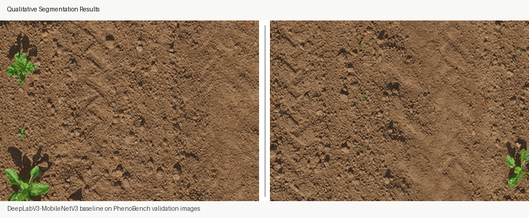
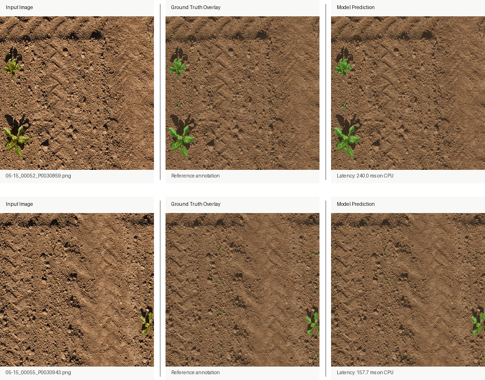

# Real-Time Segmentation Pipeline on PhenoBench

End-to-end semantic segmentation pipeline for noisy outdoor visual data, using PhenoBench as the benchmark dataset.

This repository is positioned as an engineering pipeline, not a dataset release:

- train a segmentation model
- validate it on a fixed benchmark split
- export it to ONNX
- benchmark runtime
- run deployment-style tiled inference

<p align="center">
  
</p>

## 3-Second Summary

Problem:
semantic segmentation under clutter, occlusion, changing illumination, and strong class imbalance.

Solution:
a reproducible PyTorch pipeline with Docker support, evaluation, runtime benchmarking, ONNX export, and tiled inference.

Output:
a working baseline for comparing segmentation models under real-world conditions, with a clear path from training to deployment-oriented inference.

## Problem, Solution, Benefit

### Problem

Industrial vision systems often need to separate relevant regions from difficult backgrounds under imperfect conditions:

- cluttered scenes
- partial visibility
- changing illumination
- class imbalance
- runtime constraints

PhenoBench is a useful benchmark for this because the visual difficulty is real, dense, and noisy at pixel level.

### Solution

This repository provides a reproducible segmentation pipeline with:

- training and validation
- checkpointing
- ONNX export
- runtime benchmarking
- Dockerized execution
- deployment-style tiled inference
- interactive notebook-based result inspection

### Benefit

The value is not limited to agriculture. The same workflow transfers to industrial computer vision scenarios such as:

- defect or anomaly region segmentation
- object isolation in production imagery
- quality inspection under variable lighting
- deployment benchmarking for edge or workstation inference

## Data Used

This project uses the external PhenoBench benchmark:

- RGB field images
- pixel-wise semantic segmentation masks
- train / validation split for supervised learning

Relevant label set:

- `0`: soil / background
- `1`: crop
- `2`: weed
- `3`: partial-crop
- `4`: partial-weed

In this repository, these labels are mapped either to:

- `multiclass`: soil / crop / weed
- `weed_binary`: non-weed / weed

## Results At A Glance

Qualitative examples from the current checkpoint:

<p align="center">
  
</p>

What this shows:

- the original image
- the reference ground-truth overlay
- the model prediction overlay
- per-sample CPU latency for the shown example

Current measured runtime on this machine with the baseline model and `512x512` inputs:

- CPU latency: `313.59 ms / image`
- CPU throughput: `3.19 FPS`

## Disclaimer

- this repository does not provide, redistribute, or own the PhenoBench dataset
- PhenoBench is an external benchmark maintained by its original authors
- this project is a testbed for semantic segmentation experiments and model comparison
- you must obtain the dataset from the official PhenoBench source and follow its license terms

## Why This Matters Beyond Agriculture

Although the benchmark data comes from crop and weed segmentation, the engineering problem is broader:

- noisy visual scenes
- partially visible objects
- strong foreground-background imbalance
- deployment constraints on inference time

The same pipeline pattern is transferable to industrial vision tasks such as:

- automated quality inspection
- defect segmentation
- object-region segmentation on production lines
- robustness testing under visually difficult conditions

## Current Pipeline

The repository currently supports this flow:

`dataset -> training -> validation -> checkpointing -> ONNX export -> runtime benchmark -> tiled inference`

Main entry points:

- training: `python -m src.train_semseg`
- evaluation: `python -m src.eval_semseg`
- ONNX export: `python -m src.export_onnx`
- runtime benchmark: `python -m src.benchmark_runtime`
- tiled inference: `python -m src.infer_tile_5mp`

## Current Measured Runtime

Measured locally on March 26, 2026 with the current baseline model and `512x512` input:

- CPU latency: `313.59 ms / image`
- CPU throughput: `3.19 FPS`
- benchmark command:

```bash
python -m src.benchmark_runtime --task multiclass --image_size 512 --iters 20 --warmup 5 --device cpu
```

GPU runtime is not reported here because CUDA is not currently available on this machine. The Docker path is GPU-ready, but actual GPU numbers depend on the host driver/runtime.

## Task Definitions

The code supports two segmentation targets:

- `multiclass`: soil / crop / weed
- `weed_binary`: weed / non-weed

Raw PhenoBench semantic labels:

- `0`: background / soil
- `1`: crop
- `2`: weed
- `3`: partial-crop
- `4`: partial-weed

Mapping used in this repository:

- `multiclass`: `0=soil`, `1=crop`, `2=weed`
- `weed_binary`: `0=non_weed`, `1=weed`

Conversion rules:

- `3 -> 1` in `multiclass`
- `4 -> 2` in `multiclass`
- `{0,1,3} -> 0` in `weed_binary`
- `{2,4} -> 1` in `weed_binary`

## Dataset Expectations

This code expects a local PhenoBench copy in the following structure:

- `PhenoBench/train/images`
- `PhenoBench/train/semantics`
- `PhenoBench/val/images`
- `PhenoBench/val/semantics`

Reference split sizes:

- train: `1407`
- val: `772`
- test: `693`

## Repository Structure

- `src/data_phenobench.py`: dataset loader and label mapping
- `src/models.py`: DeepLabV3-MobileNetV3 model builder
- `src/train_semseg.py`: training loop and checkpointing
- `src/eval_semseg.py`: validation on the official split
- `src/export_onnx.py`: export a trained checkpoint to ONNX
- `src/benchmark_runtime.py`: latency and FPS measurement
- `src/infer_tile_5mp.py`: tiled deployment-style inference
- `src/metrics.py`: IoU and mIoU computation
- `docker/Dockerfile`: reproducible runtime container
- `docker/run.sh`: helper wrapper for Docker execution

## Local Python Setup

```bash
python3 -m venv .venv
source .venv/bin/activate
python -m pip install --upgrade pip
python -m pip install -r requirements.txt
```

The `requirements.txt` file now includes `onnx`, so the model export command works in both local Python and the base Docker image.

## Training

Default behavior without `--task` is `multiclass`.

Multiclass training:

```bash
python -m src.train_semseg \
  --data_root ./PhenoBench \
  --epochs 5 \
  --image_size 512 \
  --batch_size 4 \
  --amp
```

Weed-vs-non-weed training:

```bash
python -m src.train_semseg \
  --data_root ./PhenoBench \
  --task weed_binary \
  --epochs 5 \
  --image_size 512 \
  --batch_size 4 \
  --amp
```

## Evaluation

Multiclass evaluation:

```bash
python -m src.eval_semseg \
  --data_root ./PhenoBench \
  --split val \
  --ckpt runs/ckpt_best.pt \
  --image_size 512
```

Weed-binary evaluation:

```bash
python -m src.eval_semseg \
  --data_root ./PhenoBench \
  --task weed_binary \
  --split val \
  --ckpt runs/ckpt_best.pt \
  --image_size 512
```

## ONNX Export

Export a trained checkpoint for downstream runtime work:

```bash
python -m src.export_onnx \
  --ckpt runs/ckpt_best.pt \
  --task multiclass \
  --image_size 512 \
  --out runs/model.onnx
```

## Runtime Benchmarking

CPU example:

```bash
python -m src.benchmark_runtime \
  --ckpt runs/ckpt_best.pt \
  --task multiclass \
  --image_size 512 \
  --iters 20 \
  --warmup 5 \
  --device cpu
```

CUDA example:

```bash
python -m src.benchmark_runtime \
  --ckpt runs/ckpt_best.pt \
  --task multiclass \
  --image_size 512 \
  --iters 50 \
  --warmup 10 \
  --device cuda
```

## Deployment-Style Inference

Run tiled inference on a single image and save an overlay:

```bash
python -m src.infer_tile_5mp \
  --image ./PhenoBench/val/images/<image_name>.png \
  --ckpt runs/ckpt_best.pt \
  --task multiclass \
  --out_png pred_overlay.png
```

This script is useful because it mimics the kind of sliding-window inference often needed for larger real-world images rather than assuming small fixed inputs.

## Docker Usage

Build the image:

```bash
docker build -t phenobench-semseg -f docker/Dockerfile .
```

### Direct Docker Commands

Your current commands:

```bash
docker run --rm -it --gpus all -v "$PWD":/workspace -w /workspace phenobench-semseg \
  python -m src.train_semseg --data_root /workspace/PhenoBench --epochs 5 --image_size 512 --batch_size 4 --amp

docker run --rm -it --gpus all -v "$PWD":/workspace -w /workspace phenobench-semseg \
  python -m src.eval_semseg --data_root /workspace/PhenoBench --split val --ckpt runs/ckpt_best.pt --image_size 512
```

What they mean:

- `--rm`: remove the container after the run
- `-it`: interactive terminal
- `--gpus all`: expose all visible NVIDIA GPUs to the container
- `-v "$PWD":/workspace`: mount the repository into the container
- `-w /workspace`: execute from the repository root inside the container
- no `--task` flag means the default task is `multiclass`

Weed-binary versions:

```bash
docker run --rm -it --gpus all -v "$PWD":/workspace -w /workspace phenobench-semseg \
  python -m src.train_semseg --data_root /workspace/PhenoBench --task weed_binary --epochs 5 --image_size 512 --batch_size 4 --amp

docker run --rm -it --gpus all -v "$PWD":/workspace -w /workspace phenobench-semseg \
  python -m src.eval_semseg --data_root /workspace/PhenoBench --task weed_binary --split val --ckpt runs/ckpt_best.pt --image_size 512
```

### Helper Script

`docker/run.sh` wraps both image build and container run:

```bash
chmod +x docker/run.sh

./docker/run.sh python -m src.train_semseg \
  --data_root /workspace/PhenoBench --epochs 5 --image_size 512 --batch_size 4 --amp

./docker/run.sh python -m src.eval_semseg \
  --data_root /workspace/PhenoBench --split val --ckpt runs/ckpt_best.pt --image_size 512
```

Important detail:

- the helper script rebuilds the Docker image every time you call it

### Jupyter Notebook In Docker

Yes. The repository includes a notebook-ready Docker path for interactive demos.

Files:

- `docker/Dockerfile.notebook`
- `docker/run_notebook.sh`
- `notebooks/interactive_results.ipynb`

Start Jupyter Lab in Docker:

```bash
chmod +x docker/run_notebook.sh
./docker/run_notebook.sh
```

Then open the URL shown by Jupyter in your browser, usually:

```text
http://127.0.0.1:8888/lab?token=...
```

If port `8888` is already in use, start it on another host port:

```bash
HOST_PORT=8890 ./docker/run_notebook.sh
```

Then open:

```text
http://127.0.0.1:8890/lab?token=...
```

What this does:

- builds the base runtime image
- builds a notebook image with `jupyterlab`
- mounts your repository at `/workspace`
- exposes port `8888`
- starts Jupyter Lab inside the container

If your machine does not have CUDA available, edit `docker/run_notebook.sh` and remove:

```text
--gpus all
```

## CUDA Notes

- `--amp` is mainly beneficial when CUDA is available
- `--gpus all` requires a working NVIDIA driver and Docker GPU runtime on the host
- if CUDA is unavailable, run on CPU and drop `--amp`
- the current local Python environment has a CUDA-capable PyTorch build, but this machine currently does not expose a usable GPU

## Known Limitations

- weed pixels are a very small fraction of the dataset, so class imbalance is severe
- the current baseline is intentionally lightweight, not state of the art
- the repo currently focuses on a reproducible baseline pipeline rather than a production deployment target
- industrial transfer is architectural and methodological, not domain-identical

## Reference

- PhenoBench: https://www.phenobench.org/
- Dataset page: https://www.phenobench.org/dataset.html
